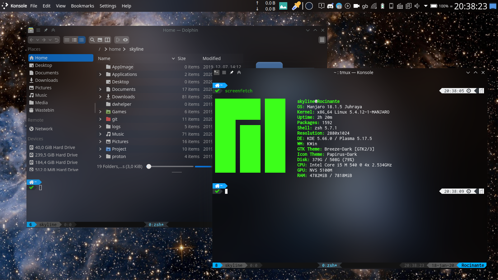
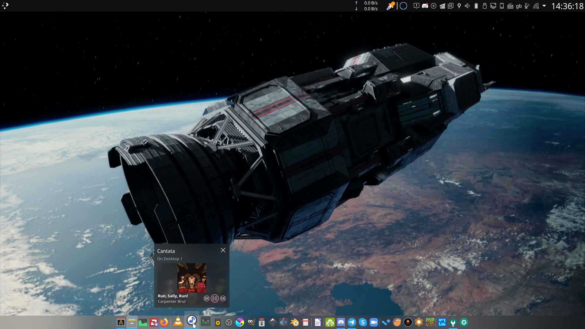
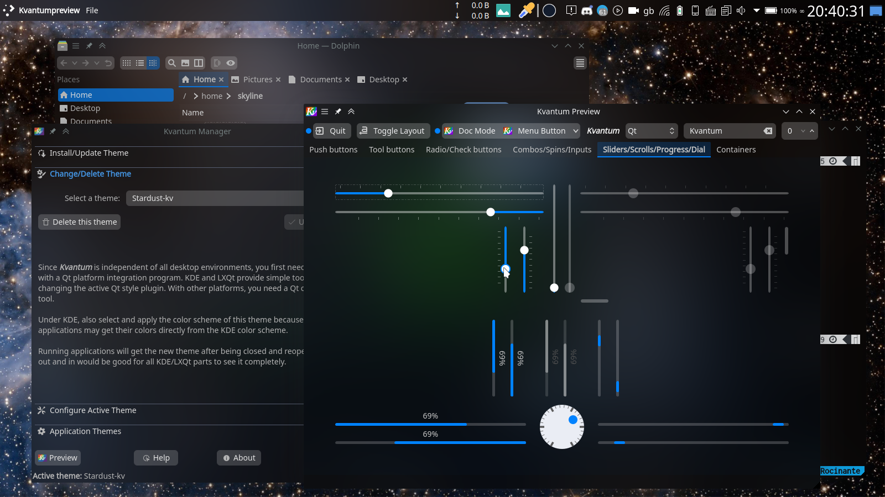
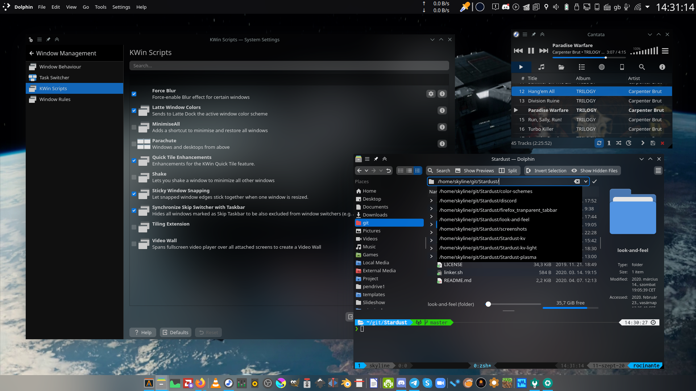
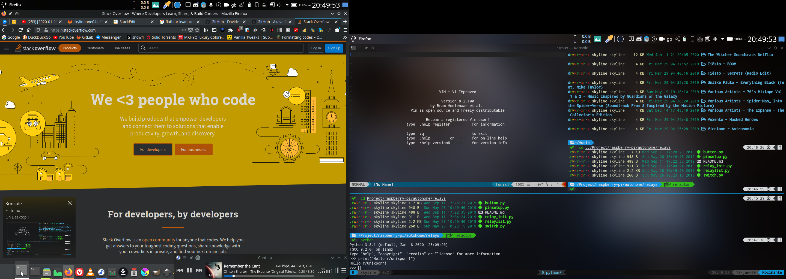

# Stardust

## Kvantum theme
Stardust-kv is a theme using the [Kvantum](https://github.com/tsujan/Kvantum/tree/master/Kvantum) theme engine.
It is based on [FlatBlur](https://github.com/Davide-sd/FlatBlur), which is based on [Akava-Kv](https://github.com/Akava-Design/Akava-Kv)

## Plasma theme
Stardust-plasma is the complementing theme for Stardust-kv to make the plasma desktop look like the rest of the apps that have the kvantum theme applied
It is cobbled together from different pieces from [Nilium](https://store.kde.org/p/1226329), [Deepin theme for KDE](https://store.kde.org/p/1231459/), [plasma-MojaveCT-Dark](https://store.kde.org/p/1291656/), and modified in some places.

## Screenshots

