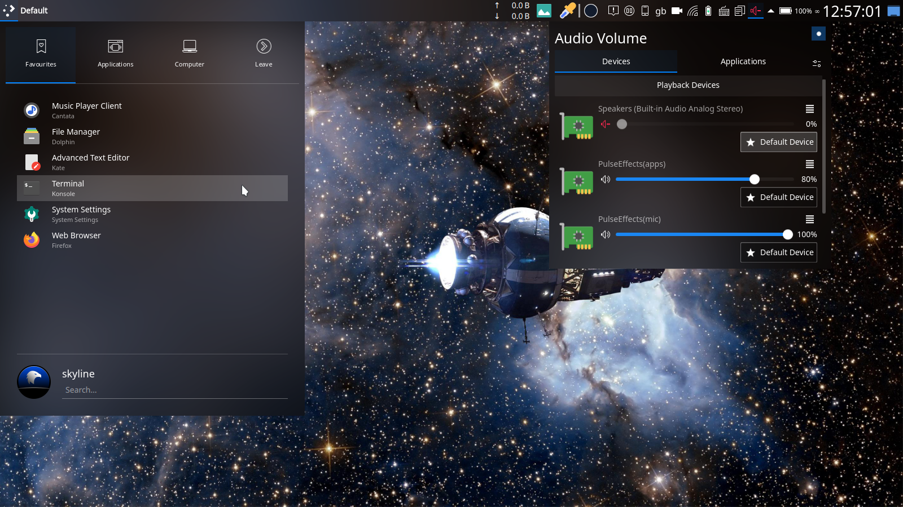
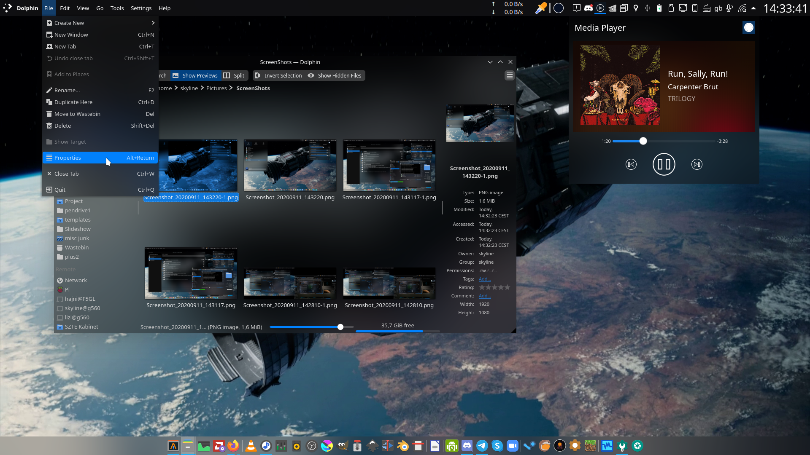
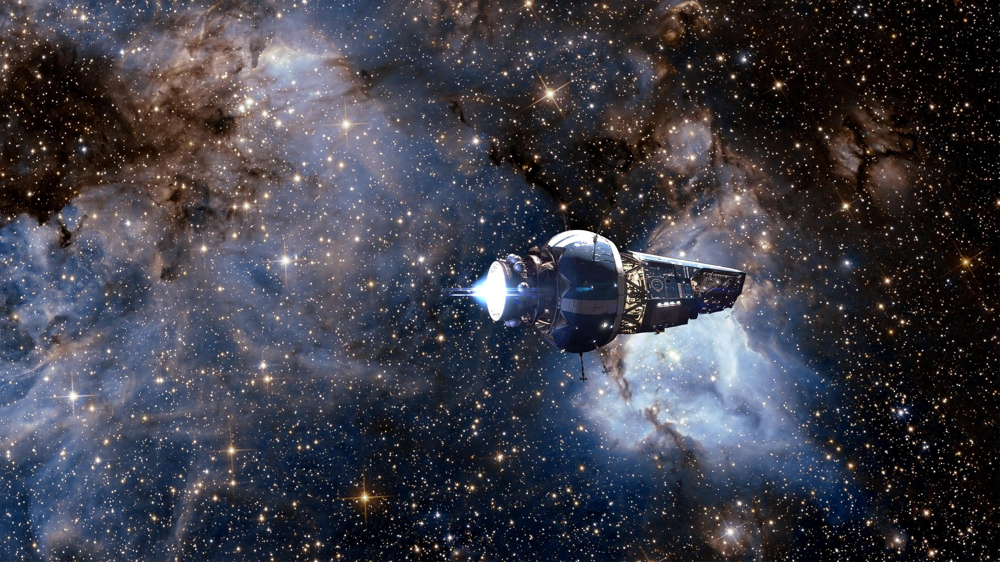

# Stardust

## Kvantum theme
Stardust-kv is a theme using the [Kvantum](https://github.com/tsujan/Kvantum/tree/master/Kvantum) theme engine.
It is based on [FlatBlur](https://github.com/Davide-sd/FlatBlur), which is based on [Akava-Kv](https://github.com/Akava-Design/Akava-Kv)

## Plasma theme
Stardust-plasma is the complementing theme for Stardust-kv to make the plasma desktop look like the rest of the apps that have the kvantum theme applied.

It is cobbled together from different pieces from [Nilium](https://store.kde.org/p/1226329), [Deepin theme for KDE](https://store.kde.org/p/1231459/), [plasma-MojaveCT-Dark](https://store.kde.org/p/1291656/), and modified in some places.

## Look-and-feel
link or move `look-and-feel/Stardust` to `~/.local/share/plasma/look-and-feel/Stardust`,
so you can easily set Plasma theme, colors, widget style, cursors, icons

This also provides the modified volume and brightness OSD, [made by koneko-nyaa](https://www.reddit.com/r/kde/comments/9j57z2/fixing_the_awful_volumebrightness_osd_size/)

## Aurorae theme (window decorations, the titlebar)
[BreezeBlurred](https://store.kde.org/p/1221562/), opacity: 45%
## Panels and dock
[Latte dock](https://store.kde.org/p/1169519/), background opacity: 5%
## Icons
[Papirus](https://store.kde.org/p/1166289/)
## Telegram theme
[Here](https://t.me/addtheme/stardust_044)
##Discord theme
Based on [Glasscord](https://github.com/AryToNeX/Glasscord/blob/master/README.md)
use their instructions
## Screenshots

---

### Wallpaper
source: [reddit of all places](https://www.reddit.com/r/TheExpanse/comments/cteld0/a_bunch_of_wallpapers_4480x1600px/)

