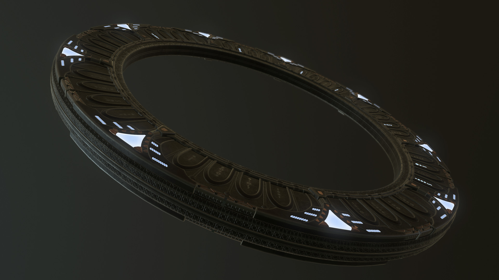

# Stardust


## Installation
```shell
cd $HOME
mkdir Projects
cd Projects/
sudo pacman -S git
git clone https://gitlab.com/skylineone044/stardust.git
cd stardust
chmod +x *.sh
bash setup.sh
```

## Kvantum theme

Stardust-kv is a theme using the
[Kvantum](https://github.com/tsujan/Kvantum/tree/master/Kvantum) theme engine.
It is based on [FlatBlur](https://github.com/Davide-sd/FlatBlur),
which is based on [Akava-Kv](https://github.com/Akava-Design/Akava-Kv)

## Plasma theme

Stardust-plasma is the complementing theme for Stardust-kv to make the plasma
desktop look like the rest of the apps that have the kvantum theme applied.

It is cobbled together from different pieces from
[Nilium](https://store.kde.org/p/1226329),
[Deepin theme for KDE](https://store.kde.org/p/1231459/),
[plasma-MojaveCT-Dark](https://store.kde.org/p/1291656/),
and modified in some places.

## Look-and-feel

link or move `look-and-feel/Stardust` to `~/.local/share/plasma/look-and-feel/Stardust`,
so you can easily set Plasma theme, colors, widget style, cursors, icons

## Aurorae theme (window decorations, the titlebar)

[ClassikStyles](https://github.com/paulmcauley/classikstyles), opacity: 55%

## Panels and dock

[Latte dock](https://invent.kde.org/plasma/latte-dock), background opacity: 30%

## Icons

[Papirus](https://store.kde.org/p/1166289/)

## Telegram theme

[Here](https://t.me/addtheme/stardust_044)

## Discord theme

I use the [BasicBackground](https://betterdiscord.app/theme/BasicBackground)
theme, with custom modifications added with `discord/custom.css`, that are applied
using BetterDiscord's Custom CSS option

## Screenshots


### Wallpapers




